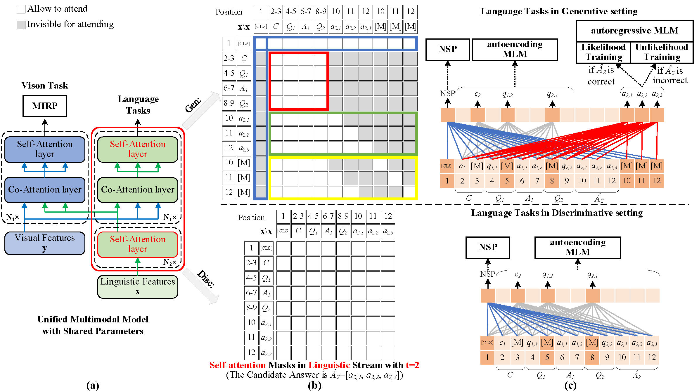

# UniMM-UL for Visual Dialog

PyTorch implementation for the paper:

**[Unified Multimodal Model with Unlikelihood Training for Visual Dialog](https://arxiv.org/abs/2211.13235)**   

The paper is avalible at [arxiv](https://arxiv.org/abs/2211.13235) and [acm digital library](https://dl.acm.org/doi/10.1145/3503161.3547974)

The task of visual dialog requires a multimodal chatbot to answer sequential questions from humans about image content. Prior work performs the standard likelihood training for answer generation on the positive instances (involving correct answers). However, the likelihood objective often leads to frequent and dull outputs and fails to exploit the useful knowledge from negative instances (involving incorrect answers). In this paper, we propose a Unified Multimodal Model with UnLikelihood Training, named UniMM-UL, to tackle this problem. First, to improve visual dialog understanding and generation by multi-task learning, our model extends ViLBERT from only supporting answer discrimination to holding both answer discrimination and answer generation seamlessly by different attention masks. Specifically, in order to make the original discriminative model compatible with answer generation, we design novel generative attention masks to implement the autoregressive Masked Language Modeling (autoregressive MLM) task. And to attenuate the adverse effects of the likelihood objective, we exploit unlikelihood training on negative instances to make the model less likely to generate incorrect answers. Then, to utilize dense annotations, we adopt different fine-tuning methods for both generating and discriminating answers, rather than just for discriminating answers as in the prior work. Finally, on the VisDial dataset, our model achieves the best generative results (69.23 NDCG score). And our model also yields comparable discriminative results with the state-of-the-art in both single-model and ensemble settings (75.92 and 76.17 NDCG scores).

<div align=center>

</div>

This repository contains code for reproducing generative and evaluation results with and without finetuning on dense annotations.
All results are on [v1.0 of the Visual Dialog dataset][visdial-data]. 

If you find this work useful in your research, please star this repo and cite the paper:

```
@inproceedings{UNIMM,
    title = {Unified Multimodal Model with Unlikelihood Training for Visual Dialog},  
    author = {Wang, Zihao and Wang, Junli and Jiang, Changjun},
    booktitle = {Proceedings of the 30th ACM International Conference on Multimedia},
    year = {2022},
    isbn = {9781450392037},
    publisher = {Association for Computing Machinery},
    address = {New York, NY, USA},
    url = {https://doi.org/10.1145/3503161.3547974},
    doi = {10.1145/3503161.3547974}, 
    pages = {4625–4634},
    numpages = {10},
    keywords = {vision and language, visual dialog, unlikelihood training},
    location = {Lisboa, Portugal},
    series = {MM '22}
}
``` 

## Table of Contents

   * [Code](#code)
      * [Download preprocessed data and Pre-trained checkpoints](#Download-preprocessed-data-and-pre-trained-checkpoint)
      * [Unified Training with sparse annotations](#Unified-Training-with-sparse-annotations)
      * [Unified fine-tuning with dense annotations](#Unified-fine-tuning-with-dense-annotations)
   * [Generative Results](#Generative-Results-on-v1.0-val)
   * [Discriminative Results](#Discriminative-Results-on-v1.0-test)
   * [Reference](#Reference)

## 

## Code

#### Download preprocessed data and pre-trained checkpoint ####

We conduct experiments on [V1.0 VisDial dataset][visdial-data] and use the same preprocessed data and pre-trained model as the [baseline][vilbert-visdial].

The preprocessed data is downloaded to `data/visdial` and the pre-trained model used in the paper are downloaded to `checkpoints-release` 
 

```
# Download preprocessed dataset and extracted features:
sh scripts/download_preprocessed.sh
```

```
# Download pre-trained checkpoints:
sh scripts/download_checkpoints.sh
```


#### Unified Training with sparse annotations

Here we list the training arguments to train the important variants in the paper.

To train the unified model with unlikelihood training (UniMM-UL) on sparse annotations:

```
python train.py -batch_size 240  -batch_multiply 1 -lr 2e-5 -image_lr 2e-5 -mask_prob 0.15 -sequences_per_image 6 -num_negative_samples 5 -start_path checkpoints-release/vqa_pretrained_weights -visdom_env ugvdce_gen_dis
```

To train the unified model without unlikelihood training (UniMM) on sparse annotations:

```
python train.py -batch_size 240  -batch_multiply 1 -lr 2e-5 -image_lr 2e-5 -mask_prob 0.15 -sequences_per_image 6 -num_negative_samples 5 -start_path checkpoints-release/vqa_pretrained_weights -visdom_env ugvdce_gen_dis_wo_ul -neg_token_weight 0 
```
 

#### Unified fine-tuning with dense annotations

To fine-tune UniMM-UL with dense annotations:

```
python dense_annotation_finetuning.py -batch_size 100 -batch_multiply 16  -lr 5e-5 -image_lr 5e-5 -nsp_loss_coeff 0 -mask_prob 0.15 -sequences_per_image 2 -start_path <path to UniMM-UL> 
```

#### Logging

We early stop the training process based on the performance of the model on the val set. [Visdom](https://github.com/facebookresearch/visdom) is used for logging. Specify `visdom_server`, `visdom_port` and `enable_visdom` arguments in options.py to use this feature. 


## Generative Results

```
# Ranking all candidate answer by sequence-level log-likelihood scores
CUDA_VISIBLE_DEVICES=0,1 nohup python -u val_lm.py -visdom_env tmp -val_dis 0 -n_gpus 2 > val_lm.log 2>&1 &
```
Generative results on VisDia v1.0 val:

|    Checkpoint    | Mean  Rank |  MRR  |  R1   |  R5   |  R10  | NDCG  |
| :--------------: | :--------: | :---: | :---: | :---: | :---: | :---: |
|      UniMM       |   13.99    | 52.29 | 42.09 | 62.96 | 70.66 | 63.89 |
|     UniMM-UL     |   10.65    | 53.49 | 42.70 | 65.03 | 74.58 | 62.86 |
| UniMM-UL + dense |   11.53    | 51.31 | 40.14 | 63.16 | 73.22 | 69.23 |


```
# Ranking all candidate answer by token-level log-likelihood scores:
CUDA_VISIBLE_DEVICES=0,1 nohup python -u val_avg_lm.py -visdom_env tmp -val_dis 0 -n_gpus 2 > val_avg_lm.log 2>&1 &

```


##  Discriminative Results

The below code snippet generates prediction files (i.e., "UniMM_UL_dense_ensemble_predictions.txt", "UniMM_UL_dense_single_predictions.txt", and "UniMM_UL_single_predictions.txt" ) which can be submitted to the [test server](https://eval.ai/web/challenges/challenge-page/518/leaderboard/1421) to get results on the test split. 

```
CUDA_VISIBLE_DEVICES=0,1,2,3 python evaluate.py -n_gpus 4 -save_name <name of model>
```

These discriminative results are on VisDial v1.0 test-std:

| Checkpoint                             | Mean  Rank | MRR   | R1    | R5    | R10   | NDCG  |
|:--------------------------------------:|:----------:|:-----:|:-----:|:-----:|:-----:|:-----:|
| UniMM-UL         |   3.27   | 68.14 | 54.57 | 85.15 | 93.13 |63.90|
| UniMM-UL + dense |   5.42   | 56.18 | 43.70 | 71.03 | 84.80 | 75.92 |
| UniMM-UL + dense + ensemble |   5.47   | 56.42 | 44.32 | 70.23 | 84.52 | 76.17 |

 

## Reference
```
@InProceedings{VisualDialog_2017_Das,
    author = {Das, Abhishek and Kottur, Satwik and Gupta, Khushi and Singh, Avi and Yadav, Deshraj and Moura, Jose M. F. and Parikh, Devi and Batra, Dhruv},
    title = {Visual Dialog},
    booktitle = {Proceedings of the IEEE Conference on Computer Vision and Pattern Recognition (CVPR)},
    month = {July},
    year = {2017}
    }
 
@article{visdial_bert
    title={Large-scale Pretraining for Visual Dialog: A Simple State-of-the-Art Baseline},
    author={Vishvak Murahari and Dhruv Batra and Devi Parikh and Abhishek Das},
    journal={arXiv preprint arXiv:1912.02379},
    year={2019},
    }   
```

[vilbert-visdial]: https://arxiv.org/abs/1912.02379	"Large-scale Pretraining for Visual Dialog: A Simple State-of-the-Art Baseline"
[vilbert]: https://arxiv.org/abs/1908.02265	"Vilbert: Pretraining task-agnostic visiolinguistic representations for vision-and-language tasks."
[visdial-data]: https://visualdialog.org/data	"Visual Dialog"


